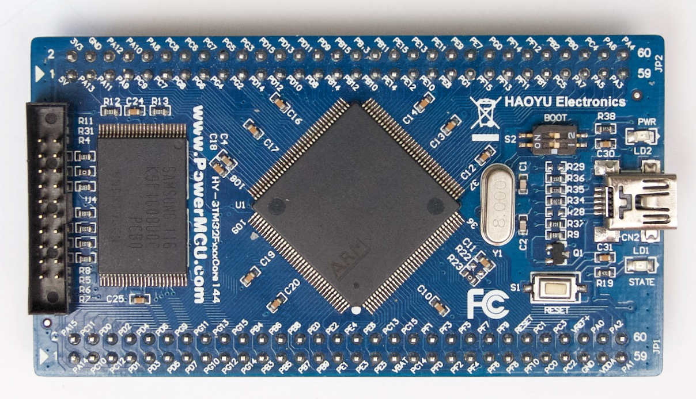

# HY-STM32F1xxCore144

The "HY-STM32F1xxCore144 Core/Dev Board" is an STMF103 board sold by
[Haoyu](http://www.hotmcu.com/hystm32f1xxcore144-coredev-board-p-2.html?cPath=1_20).
It has an STM32F103ZE with additional RAM and flash memory.

The LED is on PF6, "1" is on.

### Known issues:

* None.

Schematic: as [PDF](hycore144-schematic.pdf) (copied from the HotMCU site).
