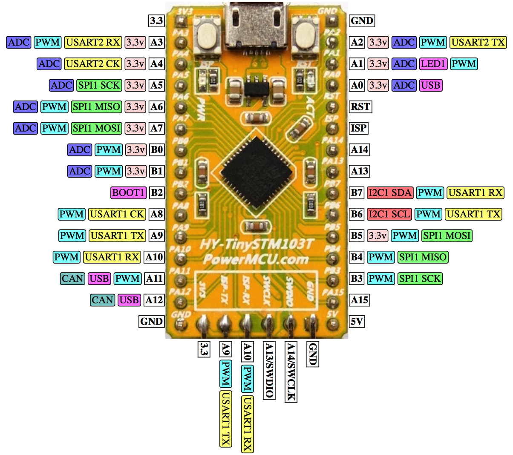

# HY-TinySTMF103T

The "HyTiny" is an STMF103-based board sold by [Haoyu](http://www.hotmcu.com/stm32f103tb-arm-cortex-m3-development-board-p-222.html).

The LED is on PA1, "0" is on.

### Known issues:

* The "SWCLK" and "SWDIO" labels are mixed up on the silkscreen.

Schematic: as [PDF](hytiny-schematic.pdf) (copied from the HotMCU site).
