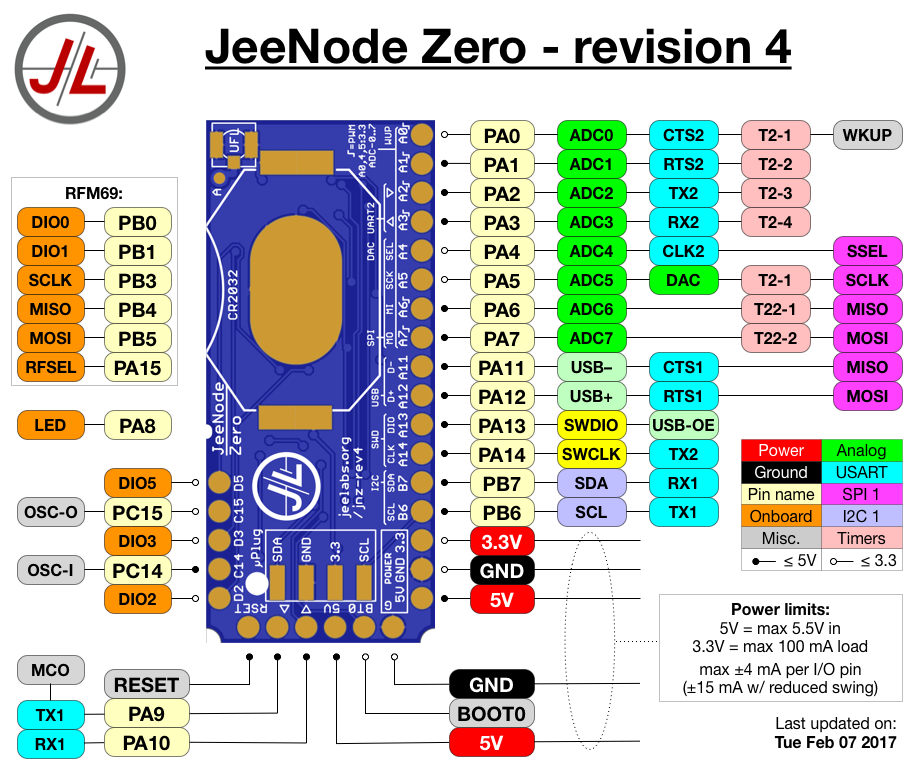
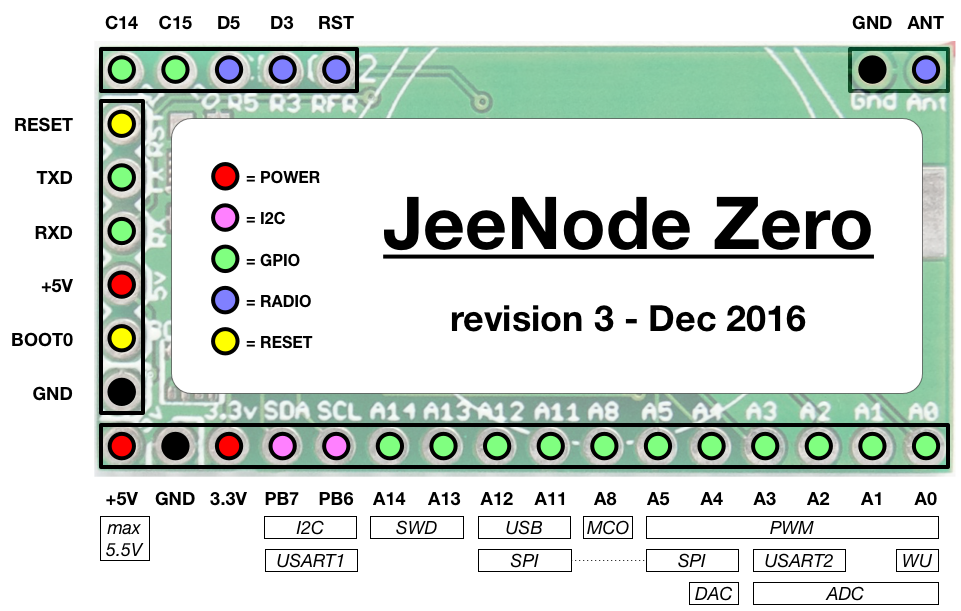
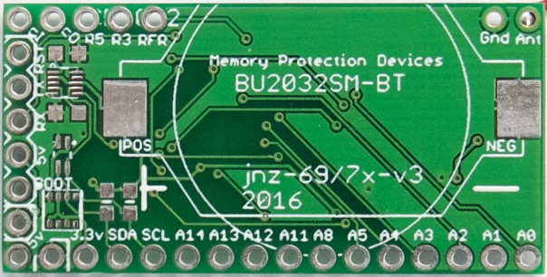
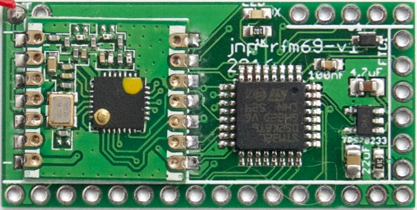
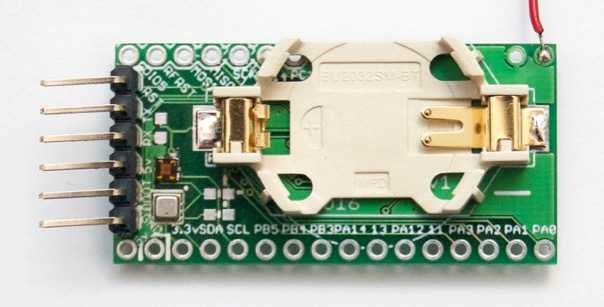
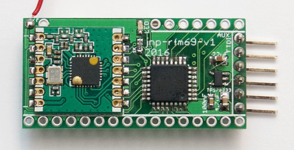

# JeeNode Zero

## JNZ revision 4

The LED is on PA8, "0" is on.

**Design files:** (Eagle v7): [schematic](jnz-rev4.sch) ([PDF](jnz-rev4.pdf)) +
[board](jnz-rev4.brd) ([PNG](jnz-rev4.png)).

For other ways of creating ARM-based nodes with an RFM69, see these articles,
which can be useful for testing RF communication to/from a JNZ:

* [Hooking up an RFM69 radio](http://jeelabs.org/article/1649e/) - Dec, 2016
* [Adding the RFM69 module](http://jeelabs.org/article/1613c/) - Apr, 2016

----

## JNZ revision 3

This is the second iteration (revision 2 never made it to an actual PCB). It has
footprints for 3 sensors on the top side: BME280 (temp/humi/pressure), VEML6040 (colour), and MAG3110
(3-axis magnetometer).

The LED is on PB5, "0" is on.

The RFM69 connections are: SSEL: PA15, SCLK: PB3, MISO: PA6, MOSI: PA7.
DIO pin connections: DIO0: PB0, DIO1: PB1, DIO2: PB4.

### Known issues:

* The VEML6040 footprint is wrong, the sensor will short out VCC.

**Design files:** (Eagle v7): [schematic](jnz-rev3.sch) ([PDF](jnz-rev3.pdf)) +
[board](jnz-rev3.brd) ([PNG](jnz-rev3.png)).

----

## JNZ revision 1

This is the first PCB prototype of the JeeNode Zero. It has footprints on the
top side for a BME280 sensor (temp/humi/pressure) and for a TSL4531X sensor
(ambient light), as well as I2C pull-ups.  It was initially populated with an
STM32L051 µC, which is pin-compatible with the L052.

The LED is on PA15, "0" is on.

The RFM69 is on PA4..7, with DIO0: PA8, DIO1: PB1, DIO2: PB0.

### Known issues:

* RESET is tied directly to FTDI's DTR, which means that a software reset will
  not work when a "stiff" output signal is present on the DTR pin.
* There is no pull-down on BOOT0, causing the board to not always start up
  properly when no FTDI adapter is present.
* The TPS78233 FB pin was left floating, it needs to be tied to ground.

**Design files:** (Eagle v7): [schematic](jnz-rev1.sch) ([PDF](jnz-rev1.pdf)) +
[board](jnz-rev1.brd) ([PNG](jnz-rev1.png)).
