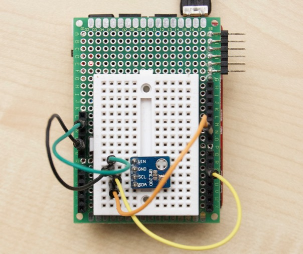

BME280 sensor explorations using the [Olimexino-STM32][O] board.

Only I2C is used here, see `../oxs` sibling folder for other pinouts:

    D5      PB6     SCL1
    D9      PB7     SDA1

   [O]: https://www.olimex.com/Products/Duino/STM32/OLIMEXINO-STM32/

Sample temperature (0.01°C), pressure (Pa), and humidity (0.01%) readings:

    2235 101779 5206
    2235 101776 5202
    2234 101776 5194
    2233 101776 5187
    2233 101771 5186

