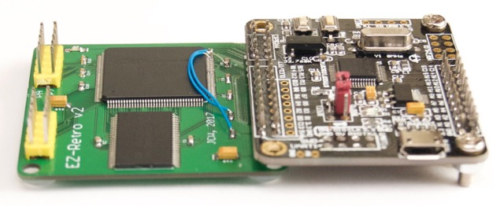

## EZ-Retro v2

> For pinouts and code related to the hand-wired EZ-Retro v1, see [this
> snapshot](https://github.com/jeelabs/embello/tree/35cb87499ef61468ee42d1ae6326ffff1cd79f05/explore/1608-forth/ezr).

Pin connections:

    PB0 = eZ80 XIN, pin 86
    PB2 = eZ80 ZDA, pin 69 (w/ 10 kΩ pull-up)
    PB4 = eZ80 ZCL, pin 67 (w/ 10 kΩ pull-up)
    PB8 = eZ80 RESET, pin 55

Serial port:

    PA2 = eZ80 RX0, pin 74
    PA3 = eZ80 TX0, pin 73

External 2048 KB RAM:

    A0..A20 = eZ80 ADDR, pins 1-5/8-13/16-21/24-27
    D0..D7 = eZ80 DATA, pins 39-46
    CEN = eZ80 CS0, pin 33
    OEN = eZ80 RDN, pin 51
    WEN = eZ80 WRN, pin 52

Micro SD card:
 
    PA4 = µSD SSEL (CS)
    PA5 = µSD SCLK (CK)
    PA6 = µSD MISO (DO)
    PA7 = µSD MOSI (DI)

SPI interconnect, eZ80 is master:

    PB10 = eZ80 PB1,  pin 101 (BUSY: STM => eZ80)
    PB12 = eZ80 PB0,  pin 100 (NSS: eZ80 => STM))
           eZ80 SS,   pin 102 (10k pullup)
    PB13 = eZ80 SCK,  pin 103
    PB14 = eZ80 MISO, pin 106
    PB15 = eZ80 MOSI, pin 107

EZ-Retro v2 build, after the [PCB fixes](http://jeelabs.org/article/1717e):

Schematic of the STM32F103 board ([from eBay](http://www.ebay.com/itm/222253881878)):

