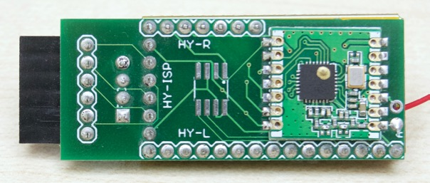

This area is for the "Tiny Extender", a HyTiny with an "Extender PCB".

The PCB combines a HyTiny (STM32F103), optional RFM69CW, optional SPI flash,
and female FTDI host header (i.e. to talk to and program a JeeNode Zero, etc).

### Hardware

See the EAGLE files and derived documentation:

* `tex-v0.sch` - EAGLE 7.6 schematic
* `tex-v0.pdf` - EAGLE 7.6 schematic, as PDF
* `tex-v0.brd` - EAGLE 7.6 board layout
* `tex-v0.png` - EAGLE 7.6 board layout, as image

The PDF shows all the relevant pin assignments.




Further down below is a section about a alternate board, called the Blue Pill.

### Software

Tex (i.e. the software) runs on Mecrisp 2.3.0 or later, with console I/O over
USB.  The code for the "Serial USB driver for Forth" is in the `../suf/` area.

To load the software onto the HyTiny, you need to connect power and the PA9 +
PA10 pins to a USB-serial adapter. On the host side, you need to be running
Folie v2 or later. Use "raw" mode (-r) with a BUB or similar, or the default
telnet mode if going through a "SerPlus" interface.

> **Note:** there is a way to bypass the build steps below, which consists of
> uploading a complete pre-built image (`usb-common.hex`) into the HyTiny, but
> it tends to lag the latest releases at times - YMMV!  To try it out and take
> advantage of Folie's nifty upload-from-the-web feature, replace everything
> below with the following, all on one line:
>
>     !u https://raw.githubusercontent.com/jeelabs/embello/
>           master/explore/1608-forth/suf/usb-common.hex
>
> Then, disconnect and plug the HyTiny back in using its USB jack. Now you can
> continue with the "Update" section below to install the rest of the code.

Here is a rough outline of the steps involved to install tex from scratch:

* use Folie's `!u` command to upload `f103-mecrisp` into the HyTiny
* there are several crucial details (with ISP pressed, briefly press RESET)
* after a succesful reflash, the HyTiny now runs Forth on its USART1 interface
* go to the `../suf/` area so you can append the USB driver to it
* enter `!s f-common.fs` to send the driver, there should be no errors
* after reset, you will no longer have serial access to the HyTiny
* unplug the HyTiny and re-connect using its USB jack
* if all went well, you should be able to restart Folie and connect again
* you are now running Forth over USB, but with very little support code loaded
* the `eraseflash` word has been redefined so that the USB driver stays intact

We're almost done... hang in there!

* go back to the `../tex/` area (can be done inside Folie, using `!cd ...`)
* load the board definitions, by entering this in Folie: `!s board.fs`
* now, the basic board peripherals and pin definitions are in flash
* you can always reset the dictionary by typing `<<<board>>>`
* load some useful drivers and library code, using `!s core.fs`
* now, the RFM69 and OLED + graphics are loaded, ready for use
* at any time, to reset the Forth dict to just usb+board+core, type `<<<core>>>`

That's it. You now have a fairly complete environment running over USB. See the
`board.fs` and `core.fs` source code to find out what has been included.

For a (very) long list of what's currently defined, type `words`. For a shorter
list, you can type `list`. The last item shown is also the last word defined in
flash memory (RAM definitions always end up at the beginning of these listings).

### Reset

A USB-based console setup has some quirks, because a reset in Forth causes the
entire system to restart, losing the current USB session and re-enumerating it.
This has a similar effect as unplugging and re-plugging the HyTiny.

Right now, on MacOS this is fairly harmless, because the re-enumerated device
shows up with the same name again within a second or so, and Folie will then
automatically pick it up and re-connect.

On Linux and Windows, this is (as of end Nov 2016) not yet the case. You will
need to quit Folie, and restart it, selecting the correct USB port again - which
may have gotten a new name (i.e. `COM<N+1>`, resp. `/dev/ttyACM<N+1>`).

Resets can be generated by various words in Mecrisp Forth:

* `reset` (of course), as well as `eraseflash` and `eraseflashfrom`
* calling a previously-defined cornerstone, e.g. `<<<board>>>` or `<<<core>>>`

All of these, apart from the explicit `reset`, are due to the fact that the
Forth dictionary is a linked list, and that major surgery on it requires Mecrisp
to re-initialise itself from scratch. Including the USB driver, in this context.

Due to the disruptive nature of resets when using the console over USB, it is
not possible to send files from Folie with the above "resetting commands" in
them. Instead, you need to comment those out, type them in manually, and _then_
send the file with the remaining code.

### Telnet

Another detail to be aware of is Folie's "telnet" vs "raw" (-r) mode. In its
default telnet mode, Folie does not control the DTR/RTS pins, since these only
work with directly-attached USB-serial devices, and only when the O/S _and_ the
USB-serial interface work together fully. With net sockets, there are no pins.

Telnet is an "in-band" protocol, i.e. it uses the hex "FF" byte as special
escape to insert special messages (and to escape genuine FF bytes in the data).

Mecrisp does not know about telnet, but due to some init overrides, there is an
extra layer or decoding once `board.fs` has been installed and restarted. For
this reason, once tex has been set up, you should talk to it in Folie _without_
the "-r" option. But only then. Before that stage, all console I/O needs to be
done with in raw mode - this includies the initial `!u ...` reflash and the `!s
...` commands given to folie to send everything up to and including `board.fs`.

It's often easy to see when you get it wrong, because you'll get "funny" chars.

In short: you have to be aware of "-r" for this initial setup, but once tex is
fully installed and being used on an day-to-day basis, it's no longer needed.

### SerPlus

Tex includes a `serplus` mode, which turns the HyTiny into a USB-serial
interface (using the host FTDI connector). The difference with a BUB and other
USB-serial interfaces, is that it interprets (and strips) in-band telnet
escapes. With SerPlus, Folie can control the DTR and the RTS pin, and both reset
_and_ re-flash an attached STM32 µC board. The way to start this is to enter
`serplus` as Forth command. To switch back to Forth, you have to press the RESET
button on the HyTiny.

See the `explore/1649-f103/serplus/` folder for more information about SerPlus.

As of this writing (Nov 2016), switching to SerPlus causes a reset. See above...

### Updates

At some point there will be updates to `board.fs` or `core.fs`, or to some of
the files they include. Since all this code sits above the USB driver layer,
it can in fact be updated through USB. Here is how to update `board.fs`:

* type `eraseflash` at the Forth prompt
* the unit resets, you'll lose the USB session and may need to relaunch Folie
* when connected again, enter `words` to see all definitions scroll by
* the last two entries should be called `init` and `eraseflash`
* go to the `../tex/` area (as before, this can be done inside Folie)
* re-install the updated board code, using `!s board.fs`
* if you enter `words` now, the last item listed should be `<<<board>>>`
* board has now been replaced, but we'll need to re-install `core.fs` as well
* continue with the steps below...

To replace only the `core.fs` code and leave `board.fs` intact, start here:

* type `<<<board>>>` at the Forth prompt
* the unit resets, you'll lose the USB session and may need to relaunch Folie
* when connected again, enter `words` to see all definitions scroll by
* the last entry should be called `<<<board>>>`
* go to the `../tex/` area (as before, this can be done inside Folie)
* re-install the updated core code, using `!s core.fs`
* if you enter `words` now, the last item listed should be `<<<core>>>`

Excellent, you're done - you have a shiny new version of tex installed in flash.

Note that updates to the USB driver or to Mecrisp Forth itself cannot be done
through the USB connection. You'll need to hook up the serial port again, and
follow the "Software" instructions above, same as when installing from scratch.

### Blue Pill

There is another very common low-cost F103 board, which is often called the
"Blue Pill". It differs slightly from the HyTiny in shape and size, but also has
some other differences:

* it's a 48-pin µC, vs HyTiny's 36-pin, and has more I/O pins and h/w interfaces
* it reports 64K flash, vs 128K for the HyTiny (but rumours say it's still 128K)
* the LED is on PC13, vs PA1 on the HyTiny
* the ISP pin (BOOT0) is a yellow jumper instead of a push-button
* there's no USB-pull-up via a transistor to trigger USB re-enumeration
* instead, PA12 must be controlled internally via GPIO, using different code

That last difference makes it harder to re-use exactly the same code for both
boards. But there's a way out: since the flash sizes differ, this has been used
to differentiate between the two and create a single `f-common.fs` setup which
will auto-detect on startup and control USB accordingly.

So if you keep these differences in mind, you should be able to adapt the above
information and get the USB console working on the Blue Pill as well.

There is now a `../g6u` area for generic boards like the Blue Pill, running over
USB and with pin definitions up to 64-pin chips. Here is a transcript of loading
those definitions once the USB console is working:

```
$ cd ../g6u
$ folie -r
Select the serial port:
  1: /dev/cu.Bluetooth-Incoming-Port
  2: /dev/cu.usbmodem322F2211
? 2
Enter '!help' for additional help, or ctrc-d to quit.
[connected to /dev/cu.usbmodem322F2211]
  ok.
eraseflash
Erase block at  00006800  from Flash
[...]
Finished. Reset
[disconnected] no such file or directory
[connected to /dev/cu.usbmodem322F2211]
  ok.
!s board.fs
1> board.fs 5: ( board start: ) 00006800  ok.
5> io.fs 11: Redefine bit.  ok.
1> board.fs 29: Redefine init.  ok.
1> board.fs 38: ( board end, size: ) 00008064 6244  ok.
!s core.fs
1> core.fs 4: cr compiletoflash
 ok.
1> core.fs 5: ( core start: ) 00008800  ok.
1> core.fs 13: ( core end, size: ) 0000A7EC 8172  ok.
  ok.
hello 64 KB <g6u> 322F221E ram: 17456 free flash: 20480 free  ok.
```

You can copy this `g6u/` area as starting point for your own explorations and
projects. Note that you may have to adjust the relative directory references in
`board.fs` and `core.fs` if you copy it to a different location.
