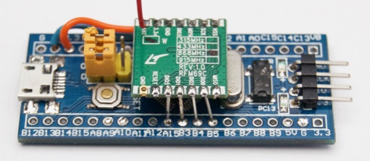
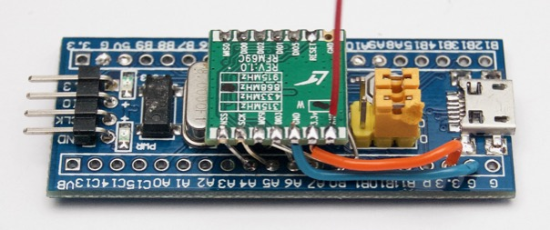
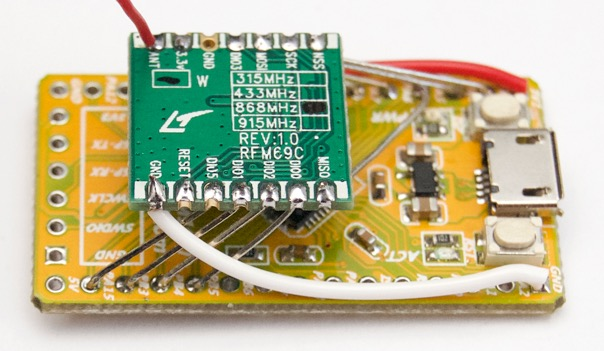

The "Tiny RF" node combines an STM32F103 board (like [this one][SB]) with an RFM69CW.  
It uses the "suf" USB-serial driver to connect to a host.

  [SB]: http://www.ebay.com/itm/311156408508







### RFM69CW pin map

```text
PA4     SSEL
PA5     SCLK
PA6     MISO
PA7     MOSI

PB0     DIO3
PB1     RESET

PA15    DIO5
PB3     DIO1
PB4     DIO2
PB5     DIO0

PC13    LED  (PA1 for HyTiny)
```

### Example of use

As entered:

```text
folie -r        <= start the Folie utility from the command line
2               <= select the second serial port
...             <= connection is lost, but folie automatically recovers
!s dev.fs       <= last command entered, radio listening starts automatically
                <= hitting <enter> after three packets have been received

```

Sample output transcript (assumes `board.fs` and `core.fs` already loaded):

```text
$ folie -r
Select the serial port:
  1: /dev/cu.Bluetooth-Incoming-Port
  2: /dev/cu.usbmodemC920C931
? 2
Enter '!help' for additional help, or ctrl-d to quit.
[connected to /dev/cu.usbmodemC920C931]
!s dev.fs
1> dev.fs 7: rf-listen
RF69 21EE0664050008C03E12 82034A1818A221A806218C25A79717A616B6
RF69 21EE066605000EC03E12 82034A1818A2219606218B25BE9717A616B5
RF69 21EE0664050024C03E12 82034A1818A2218606219025DA9717A616B5
 ok.
  ok.
```
